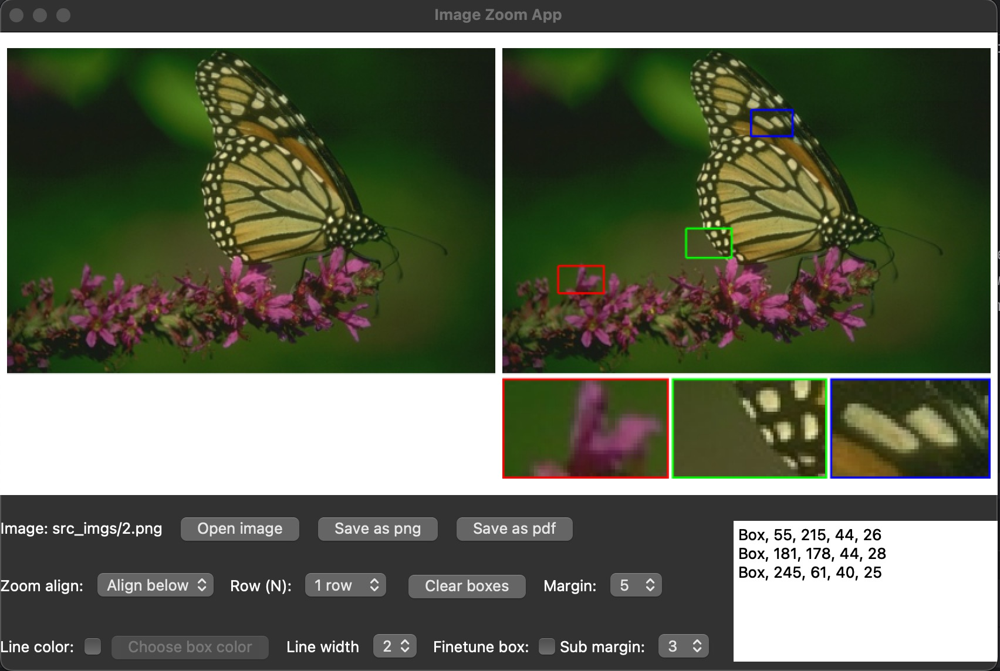
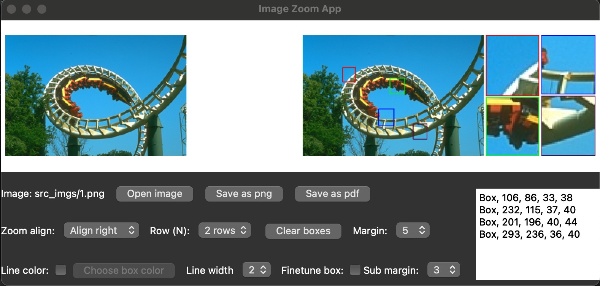

# Image Local Region Zoom App for Academic Paper Usage

An image local region zoom App to simplify the qualitative comparsion between multiple methods. Specifically, 
a source image is cropped by dragging colored boxes on it and aligned to its width or height. See examples below. This App is implemented with the help of
the powerful GPT-3.5.



## Table of Contents

1. [Features](#features)
2. [Installation](#installation)
3. [Usage](#usage)
   1. [Example](#example)
   2. [Detail settings](#detail-settings)
4. [Issues & Feedback](#issues--feedback)

## Features

- Dragging boxes freely.
- Finetune boxes by manually input (x, y, w, h).
- Align below or on the right side (multi row enabled).
- Customize box color and box linewidth.
- Save as png or pdf format.
- Flexibly and easily append to other images.
- One image done, others automatical finished.

## Installation

```
pip install PyQt5
```
This app is implemented using the famous PyQt5 library
## Usage

Run the .py file in python console

```
python single_image.py
```
### Example
- open an image as you wanted.
- You can just draw box on the right image (left image is used for reference)
- The basic box color is `red`, `green`, and `blue`, then random color is chosen.
- The default alignment style is *below*
- Click the two save button to save as .png or .pdf formats
- Once one image is finished, you can just open any other image with the same size, and the previous box
will be automatically drawn
- Delete undesired box by pressing the `backspace` key
- Click the `Clear boxes` button if you want to change another exemplar

### Detail settings
- Choose the alignment style: click the `Zoom align` combobox
- Change the number of display rows: click the `Row (N)` combobox
- Manually choose the box color: first click the `Checkbox` of `Line color`, the click the `Choose box color` button. 
After done, draw freely
- Change the box linewidth: click the `Line width` combobox and all boxes' linewidth will change
- Finetune the box for better visualization: first click the `Finetune box` checkbox, and then manually input alter the 
(x, y, w, h) values. Boxes will be automatically changed with respect to your input.

## Issues & Feedback
Feel free to raise your issues, when any bug occurs. We welcome your constructive suggestions.

  
